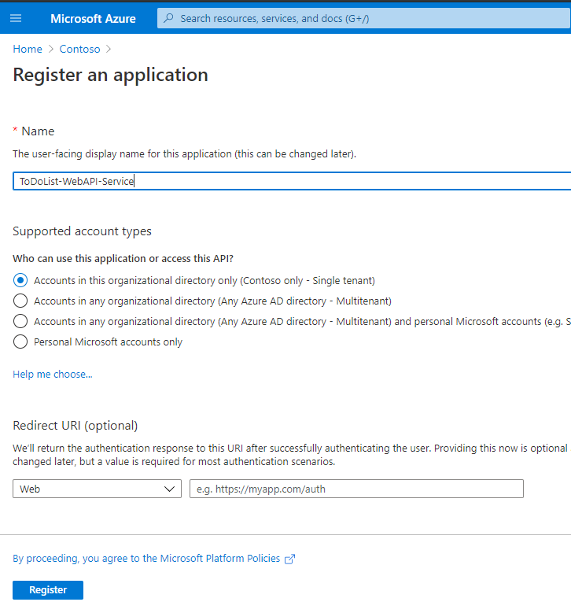
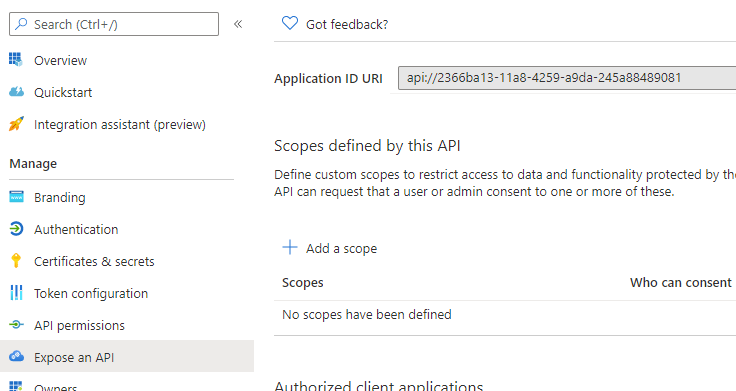

# OpenID Connect SSO Sample with .NET MVC App Calling ASPNETCORE API

This sample demonstrates how an MVC site (.NET Framework) user can login via OpenID Connect (using SSO if they're already logged in to their O365 or Azure) and then call a separate ASPNETCORE Web API service using an OAuth 2.0 client credential flow.

This sample combines two Microsoft Identity samples:

- The .NET Framework Front End MVC app is a modified version of this
  https://github.com/Azure-Samples/ms-identity-aspnet-webapp-openidconnect

- The ASPNETCORE Web API ToDo List service is a modified version of this (only the Web API project, not the console project)
  https://github.com/azure-samples/active-directory-dotnetcore-daemon-v2

## Running the Sample

### Prerequisites

- An Azure Active Directory tenant where you can grant app registration approval
- Visual Studio 2017 or 2019
- .NET Core 3.1 (for ToDo List service)
- .NET Framework 4.7.2 (for MVC web app)
- (optional) Office 365 account (to test SSO)

### Create Azure AD App Registration for ToDo List Service

1.  Go to Azure -> Azure Active Directory -> App Registrations
2.  Create a new App Registration, providing a name and select that Supported Account Types are "Accounts in this organizational directory only".
    
3.  Clicking 'Register' on the new App Registration page takes you to the Overview page. Capture the Application ID (aka the Client ID) and the Tenant ID from this page.
4.  In order to restrict clients from calling this web api to those that have certain roles, we'll create scopes for this app registration.

    Go to the 'Expose an API' in your App Registration blade. No Application ID URI has been set yet, so click 'Set'. Accept the default URI value (which is your client id).
    

5.  Now we'll define scopes in the App's Manifest. CLick on 'Manifest' in the App Registration blade. You should see a JSON document that has an empty "appRoles" element. Update the "appRoles" element to have one or more roles defined, as such:

        "appRoles": [
        {
        	"allowedMemberTypes": [
        		"Application"
        	],
        	"description": "Some additional app role here.",
        	"displayName": "My Second App Role",
        	"id": "<UNIQUE_GUID_1>",
        	"isEnabled": true,
        	"lang": null,
        	"origin": "Application",
        	"value": "SecondAppRole"
        },
        {
        	"allowedMemberTypes": [
        		"Application"
        	],
        	"description": "Daemon apps in this role can consume the web api.",
        	"displayName": "DaemonAppRole",
        	"id": "<UNIQUE_GUID_2>",
        	"isEnabled": true,
        	"lang": null,
        	"origin": "Application",
        	"value": "DaemonAppRole"
        }

    ],

    Each role entity in "appRoles" should have a unique GUID for it's "id" attribute. You can one or more appRoles defined. No need to have two defined for this sample (it's just what I chose!).

    Click Save on the Manifest tab.

### Create Azure AD App Registration for MVC Web App

1.  Now we'll create an app registration for the MVC Web App. Go back to your Azure AD tenant, and select App Registrations and click New Registration.
2.  Name your app, select "Accounts in this organizational directory only", and add "https://localhost:44326" for the Redirect URI.
    

        Clicking 'Register' takes you to the Overview page of your app registration. Note the Application (Client) ID.

3.  Click on Authentication on the App Registration blade. Under Implicit grant, check the "ID Tokens" checkbox. Click Save.
4.  Click on Certificates & Secrets. Under Client Secrets, click "+ New Client Secret". Name it, specify how long you want it to be active, and click Add. You'll see the secret show up in your list of Client Secrets. Copy the Secret Value as you won't have an opportunity to access it again. Save the secret value off where you can use it later.
5.  Click on Token Configuration, click on "+ Add Optional Claim" and select ID token. I added email, family_name, and given_name for the ID token. When you do this, you will have to have MS Graph permissions added to your app registration, so Azure will add those first and then you'll have to add those optional attributes (email, family_name, given_name) again. If you're successful, you should see the three optional claims listed.
    
6.  Click on API Permissions. Here we'll assign the MVC App the roles it needs to call the Web API app (along with granting admin consent for the MS Graph operations).
    - Click on "+ Add A Permission". A side panel swings out. Select "My APIs" and you should see your Web API app listed. Click on it. The next page in the panel should have "Application Permissions" selected and then your Web API roles that you defined in the Manifest in step 5 for the Web API registration should show up. Select the roles you want to assign to the MVC Web App. (I selected both.) Click "Add Permissions" to save.
      
    - After clicking "Add Permissions", you'll see your assigned APIs. You should then click the "Grant admin consent for <tenant name>" in order to grant admin consent for your Web API permissions.
7.  That's it for MVC App Registration! Now let's configure the code.

### Update Code for App Registration Information

We'll update both the Web API's appsettings.json file along with the web.config for the MVC Web App using the information collected from registering the two apps from above.

#### Update ASPNETCORE Web API Settings

1. Open .\TodoList-WebAPI\appsettings.json
2. Add your Web API App Registration information where the placeholders are, for client id, tenant name, and tenant id.

3. Save appsettings.json

#### Update MVC Web App web.config file

1. Open .\WebApp\web.config
2. Add MVC App Registration info **AND** Web API app registration info to the file. Replace items like your mvc client id, secret, tenant name along with your web api client id in this file.

 

3. Save web.config

### Open Browser and Test

Before running the app, let's show how your O365 logged in token flows to this application.

Open up an In-Private or Incognito browser window. Navigate to https://portal.office.com. You should be prompted for your O365 credentials. Log in and you should see a page similar to this:

After updating your appsettings.json and web.config files, you can run the project. From Visual Studio 2019, you can start both projects. The Web API should run at https://localhost:44372, and the MVC App should run at https://localhost:44326.

Navigating to https://localhost:44326, you'll be prompted for consent to use some MS Graph permissions (this is from the mail app aspects from the demo app that I used for this sample). Also note that your O365 user should also be trying to log in to this app. Accept the consent and proceed to the main page. You'll see that your credentials are now displaying on the app page.

**NOTE** This requires that your O365 tenant and your app registration tenants are the SAME. If they're not, then you'll need to create a multi-tenant app registration, which is a sample I'll build out later in another repo.

Now you can click on the 'About' menu link to get some details about your ID Token.

Lastly, you can click on the 'Call TODO List' menu item which calls the Web API service on https://localhost:44372. When you do that, you'll see that user's email address is passed to the service and returned as part of the payload.

## What's Happening in the Code?

There's three main areas where authentication and tokens are dealt with.

### Starting Up

In WebApp\Startup.Auth.cs, the `ConfigureAuth` method establishes the OpenID Connect settings for authentication calls in the web app, associating this app with the previously registered Azure AD App Registration.

In WebApp\Controllers\HomeController.cs, the `Index` method has an `[Authorize]` attribute assigned to it, so anonymous access to the site is essentially turned off. When you go to access the main page of the site (home/index) you will either be forced to log in, or if you're already logged in to an app in the tenant, then those credentials will be used.

In WebApp\Controllers\HomeController.cs, the `WebApi` method is what is called when you click on the 'Call TODO List' menu item in the web app. This call explicitly acquires an access token for calling the web api service, including the scopes/roles that it has permission for.

Lastly, in ToDoList-WebApi\Controllers.cs, the `Get` method is in a controller that has an `[Authorize]` attribute applied, so the requests must be authenticated and this method checks that the passed in token has the `DaemonAppRole` role included. If it does not, then an exception is thrown.
